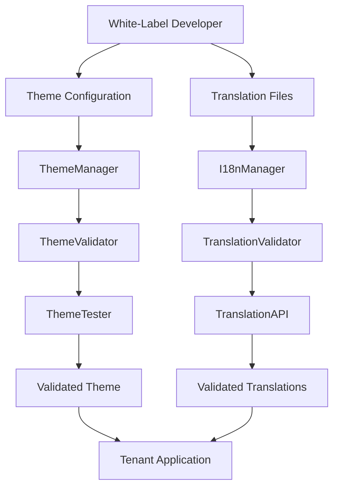

# White-Label Development Guide

## Table of Contents

1. [Overview](#overview)
2. [Architecture](#architecture)
3. [Getting Started](#getting-started)
4. [Theming System](#theming-system)
5. [Internationalization (i18n)](#internationalization-i18n)
6. [Translation Management](#translation-management)
7. [RTL Support](#rtl-support)
8. [Validation & Testing](#validation--testing)
9. [Best Practices](#best-practices)
10. [API Reference](#api-reference)
11. [Examples](#examples)
12. [Troubleshooting](#troubleshooting)

## Overview

The School SIS white-label development system provides comprehensive tools for creating custom branded experiences for educational institutions. This system supports:

- **Modular Theming**: Complete visual customization with tenant isolation
- **Internationalization**: Full i18n/l10n support with ICU MessageFormat
- **RTL Support**: Right-to-left language support for Arabic, Hebrew, Persian, and more
- **Translation Management**: API-driven translation system for white-label developers
- **Validation & Testing**: Automated testing for themes and translations
- **Cultural Formatting**: Locale-specific date, currency, and number formatting

## Architecture

### Core Components

```
frontend/white-label/
├── core/
│   ├── ThemeManager.js          # Theme management and compilation
│   └── I18nManager.js           # Internationalization management
├── api/
│   └── TranslationAPI.js        # Translation API for developers
├── validators/
│   ├── ThemeValidator.js        # Theme validation
│   └── TranslationValidator.js  # Translation validation
├── rtl/
│   └── RTLManager.js            # RTL support management
├── testing/
│   └── ThemeTester.js           # Automated theme testing
└── examples/
    ├── theme-examples/          # Theme implementation examples
    └── i18n-examples/           # i18n implementation examples
```

### Data Flow



## Getting Started

### 1. Initialize Theme Manager

```javascript
import ThemeManager from './white-label/core/ThemeManager';

const themeManager = new ThemeManager(tenantId, {
  enableCaching: true,
  enableValidation: true,
  enableCompilation: true,
  fallbackTheme: 'default'
});

// Load theme configuration
const theme = await themeManager.loadTheme(themeConfig);
```

### 2. Initialize I18n Manager

```javascript
import I18nManager from './white-label/core/I18nManager';

const i18nManager = new I18nManager(tenantId, {
  defaultLocale: 'en-US',
  fallbackLocale: 'en',
  enableICU: true,
  enableRTL: true,
  supportedLocales: ['en-US', 'es-ES', 'ar-SA']
});

// Load locale
await i18nManager.loadLocale('es-ES');
```

### 3. Apply to Application

```javascript
import { ThemeProvider } from '@mui/material/styles';
import { IntlProvider } from 'react-intl';

function App() {
  return (
    <ThemeProvider theme={theme}>
      <IntlProvider 
        locale={i18nManager.getCurrentLocale().locale}
        messages={i18nManager.currentMessages}
        formats={i18nManager.currentFormats}
      >
        {/* Your application components */}
      </IntlProvider>
    </ThemeProvider>
  );
}
```

## Theming System

### Theme Configuration Structure

```javascript
const themeConfig = {
  id: 'school-brand-theme',
  name: 'School Brand Theme',
  version: '1.0.0',
  description: 'Custom theme for school branding',
  
  // Color palette
  palette: {
    primary: {
      main: '#1976d2',
      light: '#42a5f5',
      dark: '#1565c0',
      contrastText: '#ffffff'
    },
    secondary: {
      main: '#dc004e',
      light: '#ff5983',
      dark: '#9a0036',
      contrastText: '#ffffff'
    },
    background: {
      default: '#f5f5f5',
      paper: '#ffffff'
    },
    text: {
      primary: '#212121',
      secondary: '#757575'
    }
  },
  
  // Typography
  typography: {
    fontFamily: '"Inter", "Roboto", "Helvetica", "Arial", sans-serif',
    h1: {
      fontSize: '2.125rem',
      fontWeight: 400,
      lineHeight: 1.2
    },
    h2: {
      fontSize: '1.5rem',
      fontWeight: 400,
      lineHeight: 1.3
    }
  },
  
  // Component customizations
  components: {
    MuiButton: {
      styleOverrides: {
        root: {
          borderRadius: 8,
          textTransform: 'none',
          fontWeight: 600
        }
      }
    },
    MuiCard: {
      styleOverrides: {
        root: {
          borderRadius: 12,
          boxShadow: '0 2px 8px rgba(0, 0, 0, 0.1)'
        }
      }
    }
  },
  
  // Accessibility features
  accessibility: {
    highContrast: {
      enabled: true,
      colors: {
        primary: '#000000',
        secondary: '#000000',
        background: '#ffffff',
        text: '#000000'
      }
    },
    keyboardNavigation: {
      enabled: true,
      focusIndicator: {
        visible: true,
        color: '#1976d2',
        width: '2px'
      }
    }
  },
  
  // Custom CSS
  customCSS: `
    .custom-header {
      background: linear-gradient(135deg, #667eea 0%, #764ba2 100%);
    }
  `
};
```

### Creating Custom Themes

#### 1. Extend Base Theme

```javascript
const customTheme = await themeManager.createCustomTheme('default', {
  palette: {
    primary: {
      main: '#ff6b6b'
    }
  },
  typography: {
    fontFamily: '"Poppins", sans-serif'
  }
});
```

#### 2. Apply Tenant Overrides

```javascript
const tenantBranding = {
  colors: {
    primary: '#1976d2',
    secondary: '#dc004e'
  },
  typography: {
    fontFamily: '"Inter", sans-serif'
  }
};

await themeManager.applyTenantOverrides(tenantBranding);
```

#### 3. Theme Templates

```javascript
// Apply predefined theme template
await themeManager.switchTheme('modern-blue');

// Available templates:
// - modern-blue
// - warm-orange
// - elegant-purple
// - forest-green
// - corporate-gray
```

### Theme Validation

```javascript
const validation = await themeManager.validateTheme(themeConfig);

if (!validation.isValid) {
  console.error('Theme validation failed:', validation.errors);
} else {
  console.warn('Theme validation warnings:', validation.warnings);
}
```

## Internationalization (i18n)

### ICU MessageFormat Support

The system supports full ICU MessageFormat syntax for complex translations:

```javascript
// Simple interpolation
const message = i18nManager.t('welcome', { name: 'John' });
// "Welcome, John!"

// Plural forms
const message = i18nManager.t('itemCount', { count: 5 });
// Translation: "{count, plural, =0 {No items} =1 {One item} other {# items}}"
// Result: "5 items"

// Select forms
const message = i18nManager.t('greeting', { gender: 'male' });
// Translation: "{gender, select, male {Hello sir} female {Hello madam} other {Hello}}"
// Result: "Hello sir"

// Complex nested forms
const message = i18nManager.t('notification', { 
  count: 3, 
  type: 'message',
  time: 'morning' 
});
// Translation: "{count, plural, =0 {No {type, select, message {messages} email {emails} other {items}}} =1 {One {type, select, message {message} email {email} other {item}}} other {# {type, select, message {messages} email {emails} other {items}}}} {time, select, morning {this morning} afternoon {this afternoon} other {today}}"
// Result: "3 messages this morning"
```

### Locale Management

```javascript
// Get available locales
const locales = await i18nManager.getAvailableLocales();

// Switch locale
await i18nManager.switchLocale('es-ES');

// Get current locale info
const localeInfo = i18nManager.getCurrentLocale();
console.log(localeInfo);
// {
//   locale: 'es-ES',
//   isRTL: false,
//   messagesCount: 1250,
//   formatsCount: 15
// }
```

### Formatting Functions

```javascript
// Date formatting
const formattedDate = i18nManager.formatDate(new Date(), {
  format: 'short',
  timeZone: 'UTC'
});

// Number formatting
const formattedNumber = i18nManager.formatNumber(1234.56, {
  format: 'decimal',
  minimumFractionDigits: 2
});

// Currency formatting
const formattedCurrency = i18nManager.formatCurrency(99.99, {
  currency: 'EUR',
  locale: 'es-ES'
});

// Relative time formatting
const relativeTime = i18nManager.formatRelativeTime(-2, 'hour');
// "2 hours ago"
```

## Translation Management

### Translation API Usage

```javascript
import TranslationAPI from './white-label/api/TranslationAPI';

const translationAPI = new TranslationAPI(tenantId, {
  enableValidation: true,
  enableCaching: true,
  supportedFormats: ['json', 'yaml', 'po', 'xlf']
});
```

### Register New Language

```javascript
const languageConfig = {
  locale: 'es-ES',
  name: 'Spanish (Spain)',
  nativeName: 'Español (España)',
  direction: 'ltr'
};

const result = await translationAPI.registerLanguage(languageConfig, {
  createDefaults: true,
  validate: true
});
```

### Update Translation Keys

```javascript
const translations = {
  'welcome.title': '¡Bienvenido!',
  'welcome.subtitle': 'Bienvenido a nuestro sistema escolar',
  'navigation.home': 'Inicio',
  'navigation.grades': 'Calificaciones'
};

const result = await translationAPI.updateTranslationKeys('es-ES', translations, {
  merge: true,
  validate: true
});
```

### Upload Translation File

```javascript
// JSON format
const jsonContent = `{
  "welcome.title": "¡Bienvenido!",
  "welcome.subtitle": "Bienvenido a nuestro sistema escolar"
}`;

const result = await translationAPI.uploadTranslationFile('es-ES', jsonContent, 'json', {
  merge: true,
  validate: true
});

// PO format
const poContent = `msgid "welcome.title"
msgstr "¡Bienvenido!"

msgid "welcome.subtitle"
msgstr "Bienvenido a nuestro sistema escolar"`;

const result = await translationAPI.uploadTranslationFile('es-ES', poContent, 'po', {
  merge: true,
  validate: true
});
```

### Translation Overrides

```javascript
// Add high-priority overrides
const overrides = {
  'welcome.title': '¡Bienvenido a Springfield High!',
  'school.name': 'Springfield High School'
};

await translationAPI.addTranslationOverrides('es-ES', overrides, {
  priority: 'high',
  validate: true
});

// Remove overrides
await translationAPI.removeTranslationOverrides('es-ES', ['welcome.title']);
```

### Missing Translation Detection

```javascript
const missing = await translationAPI.getMissingTranslations('es-ES', 'en-US');

console.log(missing);
// {
//   success: true,
//   locale: 'es-ES',
//   referenceLocale: 'en-US',
//   missingCount: 15,
//   missingTranslations: [
//     {
//       key: 'dashboard.analytics',
//       referenceMessage: 'Analytics Dashboard',
//       suggestedTranslation: 'Panel de Análisis'
//     }
//   ]
// }
```

## RTL Support

### Automatic RTL Detection

```javascript
// RTL locales are automatically detected
await i18nManager.switchLocale('ar-SA'); // Automatically enables RTL

// Manual RTL check
const isRTL = i18nManager.isRTL('ar-SA'); // true
```

### RTL-Specific Styling

```css
/* RTL-aware CSS using logical properties */
.element {
  margin-inline-start: 1rem; /* margin-left in LTR, margin-right in RTL */
  padding-inline-end: 0.5rem; /* padding-right in LTR, padding-left in RTL */
  border-inline-start: 1px solid #ccc; /* border-left in LTR, border-right in RTL */
}

/* RTL-specific overrides */
[dir="rtl"] .navigation {
  text-align: right;
}

[dir="rtl"] .breadcrumb {
  flex-direction: row-reverse;
}
```

### RTL Component Adjustments

```javascript
// RTL-aware spacing
const rtlSpacing = rtlManager.getRTLSpacing('marginLeft', '1rem');
// Returns: { marginRight: '1rem' } for RTL locales

// RTL-aware positioning
const rtlPosition = rtlManager.getRTLPositioning('left', '10px');
// Returns: { right: '10px' } for RTL locales

// RTL-aware CSS class creation
const rtlStyles = rtlManager.createRTLClass('button', {
  marginLeft: '1rem',
  paddingRight: '0.5rem',
  borderLeft: '1px solid #ccc'
});
```

## Validation & Testing

### Theme Testing

```javascript
import ThemeTester from './white-label/testing/ThemeTester';

const themeTester = new ThemeTester(tenantId, {
  enableVisualTesting: true,
  enableAccessibilityTesting: true,
  enablePerformanceTesting: true
});

// Run comprehensive tests
const results = await themeTester.testTheme(themeConfig, 'all');

// Run specific test suites
const validationResults = await themeTester.testTheme(themeConfig, 'validation');
const accessibilityResults = await themeTester.testTheme(themeConfig, 'accessibility');
const performanceResults = await themeTester.testTheme(themeConfig, 'performance');
```

### Translation Testing

```javascript
// Validate translation file before upload
const validation = await translationAPI.validator.validateTranslations(translations);

if (!validation.isValid) {
  console.error('Translation validation failed:', validation.errors);
} else {
  console.warn('Translation warnings:', validation.warnings);
}

// Test translation completeness
const missing = await translationAPI.getMissingTranslations('es-ES');
console.log(`Missing translations: ${missing.missingCount}`);
```

### Automated Testing Pipeline

```javascript
// Example CI/CD integration
async function runWhiteLabelTests(themeConfig, translations) {
  const results = {
    theme: await themeTester.testTheme(themeConfig),
    translations: await translationAPI.validator.validateTranslations(translations)
  };
  
  // Fail build if critical issues found
  if (results.theme.summary.failed > 0 || !results.translations.isValid) {
    throw new Error('White-label validation failed');
  }
  
  return results;
}
```

## Best Practices

### 1. Theme Development

#### Isolation and Modularity
- **Tenant Isolation**: Ensure themes don't affect other tenants
- **Modular Configuration**: Use configuration objects instead of hardcoding
- **Backward Compatibility**: Maintain compatibility with older theme versions

```javascript
// Good: Modular theme configuration
const themeConfig = {
  extends: 'base-theme',
  overrides: {
    colors: tenantBranding.colors,
    typography: tenantBranding.typography
  }
};

// Bad: Hardcoded values
const theme = createTheme({
  palette: { primary: { main: '#1976d2' } } // Hardcoded
});
```

#### Performance Optimization
- **CSS Optimization**: Minimize CSS bundle size
- **Lazy Loading**: Load theme resources on demand
- **Caching**: Enable theme caching for better performance

```javascript
// Enable caching and optimization
const themeManager = new ThemeManager(tenantId, {
  enableCaching: true,
  enableCompilation: true,
  cacheExpiry: 3600000 // 1 hour
});
```

#### Accessibility Compliance
- **Color Contrast**: Ensure WCAG 2.1 AA compliance
- **Keyboard Navigation**: Support keyboard-only navigation
- **Screen Reader**: Provide proper ARIA labels and semantic markup

```javascript
// Include accessibility features
const themeConfig = {
  accessibility: {
    highContrast: { enabled: true },
    keyboardNavigation: { enabled: true },
    screenReader: { enabled: true }
  }
};
```

### 2. Translation Management

#### Translation Keys
- **Hierarchical Structure**: Use dot notation for organization
- **Descriptive Names**: Use clear, descriptive key names
- **Consistent Naming**: Follow consistent naming conventions

```javascript
// Good: Hierarchical and descriptive
const translations = {
  'navigation.home': 'Home',
  'navigation.students.grades': 'Student Grades',
  'forms.validation.required': 'This field is required'
};

// Bad: Flat and unclear
const translations = {
  'home': 'Home',
  'grades': 'Grades',
  'required': 'Required'
};
```

#### ICU MessageFormat
- **Use for Complex Cases**: Use ICU for pluralization and selection
- **Keep Simple**: Use simple interpolation for basic cases
- **Test Thoroughly**: Test all ICU format variations

```javascript
// Good: Use ICU for complex cases
const message = i18nManager.t('notification', { 
  count: 5, 
  type: 'message' 
});
// Translation: "{count, plural, =0 {No {type, select, message {messages} email {emails}}} =1 {One {type, select, message {message} email {email}}} other {# {type, select, message {messages} email {emails}}}}"

// Good: Keep simple cases simple
const message = i18nManager.t('welcome', { name: 'John' });
// Translation: "Welcome, {name}!"
```

#### Translation Workflow
- **Version Control**: Keep translation files in version control
- **Review Process**: Implement translation review process
- **Fallback Strategy**: Always provide fallback translations

```javascript
// Always provide fallbacks
const message = i18nManager.t('key', values, {
  defaultMessage: 'Fallback message',
  description: 'Description for translators'
});
```

### 3. RTL Support

#### CSS Best Practices
- **Logical Properties**: Use CSS logical properties
- **RTL-Aware Classes**: Create RTL-aware CSS classes
- **Test Both Directions**: Test in both LTR and RTL modes

```css
/* Good: Use logical properties */
.element {
  margin-inline-start: 1rem;
  padding-inline-end: 0.5rem;
  border-inline-start: 1px solid #ccc;
}

/* Good: RTL-aware classes */
.navigation {
  text-align: start; /* text-align: left in LTR, right in RTL */
}

[dir="rtl"] .navigation {
  text-align: right; /* Explicit RTL override if needed */
}
```

#### JavaScript RTL Handling
- **RTL Detection**: Always check RTL status before applying styles
- **Dynamic Adjustments**: Adjust layouts dynamically for RTL
- **Icon Handling**: Handle icon direction changes for RTL

```javascript
// Check RTL status
if (rtlManager.isRTL()) {
  // Apply RTL-specific logic
  element.classList.add('rtl-adjusted');
}

// RTL-aware icon handling
const arrowIcon = rtlManager.isRTL() ? 'arrow-right' : 'arrow-left';
```

### 4. Validation and Testing

#### Automated Testing
- **Continuous Integration**: Integrate tests into CI/CD pipeline
- **Visual Regression**: Use visual regression testing for themes
- **Accessibility Testing**: Include accessibility tests in pipeline

```javascript
// CI/CD integration example
async function validateWhiteLabel(themeConfig, translations) {
  const themeResults = await themeTester.testTheme(themeConfig);
  const translationResults = await translationValidator.validateTranslations(translations);
  
  if (themeResults.summary.failed > 0 || !translationResults.isValid) {
    throw new Error('White-label validation failed');
  }
  
  return { themeResults, translationResults };
}
```

#### Manual Testing
- **Cross-Browser Testing**: Test in multiple browsers
- **Device Testing**: Test on various devices and screen sizes
- **User Testing**: Conduct user testing with target audience

### 5. Performance Optimization

#### Theme Performance
- **CSS Optimization**: Minimize and optimize CSS
- **Lazy Loading**: Load theme resources on demand
- **Caching**: Implement proper caching strategies

```javascript
// Optimize theme loading
const themeManager = new ThemeManager(tenantId, {
  enableCaching: true,
  enableCompilation: true,
  cacheExpiry: 3600000
});
```

#### Translation Performance
- **Lazy Loading**: Load translations on demand
- **Caching**: Cache translations for better performance
- **Bundle Optimization**: Optimize translation bundles

```javascript
// Optimize translation loading
const i18nManager = new I18nManager(tenantId, {
  enableCaching: true,
  cacheExpiry: 3600000
});
```

## API Reference

### ThemeManager

#### Constructor
```javascript
new ThemeManager(tenantId, options)
```

**Parameters:**
- `tenantId` (string): Unique tenant identifier
- `options` (object): Configuration options
  - `enableCaching` (boolean): Enable theme caching (default: true)
  - `enableValidation` (boolean): Enable theme validation (default: true)
  - `enableCompilation` (boolean): Enable theme compilation (default: true)
  - `fallbackTheme` (string): Fallback theme ID (default: 'default')

#### Methods

##### loadTheme(themeConfig, options)
Load and apply theme configuration.

**Parameters:**
- `themeConfig` (object): Theme configuration object
- `options` (object): Loading options
  - `validate` (boolean): Validate theme (default: true)
  - `compile` (boolean): Compile theme (default: true)
  - `cache` (boolean): Cache theme (default: true)

**Returns:** Promise<Theme>

##### createCustomTheme(baseThemeId, customizations)
Create custom theme from base theme.

**Parameters:**
- `baseThemeId` (string): Base theme identifier
- `customizations` (object): Custom theme properties

**Returns:** Promise<Theme>

##### applyTenantOverrides(tenantBranding)
Apply tenant-specific theme overrides.

**Parameters:**
- `tenantBranding` (object): Tenant branding configuration

**Returns:** Promise<Theme>

##### switchTheme(themeId, options)
Switch to different theme.

**Parameters:**
- `themeId` (string): Theme identifier
- `options` (object): Switch options

**Returns:** Promise<Theme>

##### validateTheme(themeConfig)
Validate theme configuration.

**Parameters:**
- `themeConfig` (object): Theme configuration to validate

**Returns:** Promise<ValidationResult>

### I18nManager

#### Constructor
```javascript
new I18nManager(tenantId, options)
```

**Parameters:**
- `tenantId` (string): Unique tenant identifier
- `options` (object): Configuration options
  - `defaultLocale` (string): Default locale (default: 'en-US')
  - `fallbackLocale` (string): Fallback locale (default: 'en')
  - `enableICU` (boolean): Enable ICU MessageFormat (default: true)
  - `enableRTL` (boolean): Enable RTL support (default: true)
  - `supportedLocales` (array): Supported locales array

#### Methods

##### loadLocale(locale, options)
Load locale-specific translations and formats.

**Parameters:**
- `locale` (string): Locale identifier
- `options` (object): Loading options
  - `validate` (boolean): Validate translations (default: true)
  - `cache` (boolean): Cache translations (default: true)
  - `forceReload` (boolean): Force reload from source (default: false)

**Returns:** Promise<LocaleData>

##### t(messageId, values, options)
Get translated message.

**Parameters:**
- `messageId` (string): Translation key
- `values` (object): Interpolation values
- `options` (object): Translation options
  - `defaultMessage` (string): Default message
  - `description` (string): Description for translators
  - `locale` (string): Specific locale
  - `escapeValue` (boolean): Escape HTML values (default: true)

**Returns:** string

##### switchLocale(locale, options)
Switch to different locale.

**Parameters:**
- `locale` (string): Locale identifier
- `options` (object): Switch options

**Returns:** Promise<boolean>

##### formatDate(date, options)
Format date according to locale.

**Parameters:**
- `date` (Date): Date to format
- `options` (object): Formatting options
  - `format` (string): Format type (default: 'short')
  - `timeZone` (string): Time zone (default: 'UTC')
  - `locale` (string): Specific locale

**Returns:** string

##### formatNumber(number, options)
Format number according to locale.

**Parameters:**
- `number` (number): Number to format
- `options` (object): Formatting options
  - `format` (string): Format type (default: 'decimal')
  - `currency` (string): Currency code
  - `locale` (string): Specific locale

**Returns:** string

### TranslationAPI

#### Constructor
```javascript
new TranslationAPI(tenantId, options)
```

**Parameters:**
- `tenantId` (string): Unique tenant identifier
- `options` (object): Configuration options
  - `enableValidation` (boolean): Enable validation (default: true)
  - `enableCaching` (boolean): Enable caching (default: true)
  - `enableOverrides` (boolean): Enable overrides (default: true)
  - `supportedFormats` (array): Supported file formats

#### Methods

##### registerLanguage(languageConfig, options)
Register new language for tenant.

**Parameters:**
- `languageConfig` (object): Language configuration
  - `locale` (string): Locale identifier
  - `name` (string): Language name
  - `nativeName` (string): Native language name
  - `direction` (string): Text direction (default: 'ltr')
- `options` (object): Registration options
  - `validate` (boolean): Validate configuration (default: true)
  - `createDefaults` (boolean): Create default translations (default: true)
  - `overwrite` (boolean): Overwrite existing (default: false)

**Returns:** Promise<RegistrationResult>

##### updateTranslationKeys(locale, translations, options)
Update translation keys for language.

**Parameters:**
- `locale` (string): Locale identifier
- `translations` (object): Translation key-value pairs
- `options` (object): Update options
  - `validate` (boolean): Validate translations (default: true)
  - `merge` (boolean): Merge with existing (default: true)
  - `createMissing` (boolean): Create missing language (default: false)

**Returns:** Promise<UpdateResult>

##### uploadTranslationFile(locale, fileContent, format, options)
Upload translation file.

**Parameters:**
- `locale` (string): Locale identifier
- `fileContent` (string): File content
- `format` (string): File format ('json', 'yaml', 'po', 'xlf')
- `options` (object): Upload options
  - `validate` (boolean): Validate translations (default: true)
  - `merge` (boolean): Merge with existing (default: true)
  - `overwriteExisting` (boolean): Overwrite existing keys (default: false)

**Returns:** Promise<UploadResult>

##### getMissingTranslations(locale, referenceLocale)
Get missing translations compared to reference locale.

**Parameters:**
- `locale` (string): Target locale
- `referenceLocale` (string): Reference locale (default: 'en-US')

**Returns:** Promise<MissingTranslationsResult>

## Examples

### Complete Theme Implementation

```javascript
import React from 'react';
import { ThemeProvider } from '@mui/material/styles';
import { IntlProvider } from 'react-intl';
import ThemeManager from './white-label/core/ThemeManager';
import I18nManager from './white-label/core/I18nManager';

function WhiteLabelApp({ tenantId, themeConfig, localeConfig }) {
  const [theme, setTheme] = useState(null);
  const [messages, setMessages] = useState({});
  const [currentLocale, setCurrentLocale] = useState('en-US');

  useEffect(() => {
    initializeApp();
  }, [tenantId]);

  const initializeApp = async () => {
    try {
      // Initialize theme manager
      const themeManager = new ThemeManager(tenantId, {
        enableCaching: true,
        enableValidation: true
      });

      // Load theme
      const loadedTheme = await themeManager.loadTheme(themeConfig);
      setTheme(loadedTheme);

      // Initialize i18n manager
      const i18nManager = new I18nManager(tenantId, {
        defaultLocale: localeConfig.defaultLocale,
        enableICU: true,
        enableRTL: true
      });

      // Load locale
      await i18nManager.loadLocale(localeConfig.currentLocale);
      setMessages(i18nManager.currentMessages);
      setCurrentLocale(i18nManager.currentLocale);

    } catch (error) {
      console.error('Failed to initialize white-label app:', error);
    }
  };

  if (!theme || !messages) {
    return <div>Loading...</div>;
  }

  return (
    <ThemeProvider theme={theme}>
      <IntlProvider 
        locale={currentLocale}
        messages={messages}
      >
        {/* Your application components */}
        <YourAppComponents />
      </IntlProvider>
    </ThemeProvider>
  );
}
```

### Dynamic Theme Switching

```javascript
function ThemeSwitcher({ tenantId }) {
  const [currentTheme, setCurrentTheme] = useState('default');
  const [availableThemes, setAvailableThemes] = useState([]);

  useEffect(() => {
    loadAvailableThemes();
  }, []);

  const loadAvailableThemes = async () => {
    const themeManager = new ThemeManager(tenantId);
    const themes = await themeManager.getAvailableThemes();
    setAvailableThemes(themes);
  };

  const handleThemeChange = async (themeId) => {
    try {
      const themeManager = new ThemeManager(tenantId);
      const newTheme = await themeManager.switchTheme(themeId);
      setCurrentTheme(themeId);
      
      // Notify parent component of theme change
      onThemeChange?.(newTheme);
    } catch (error) {
      console.error('Failed to switch theme:', error);
    }
  };

  return (
    <select 
      value={currentTheme} 
      onChange={(e) => handleThemeChange(e.target.value)}
    >
      {availableThemes.map(theme => (
        <option key={theme.id} value={theme.id}>
          {theme.name}
        </option>
      ))}
    </select>
  );
}
```

### Translation Management Interface

```javascript
function TranslationManager({ tenantId, locale }) {
  const [translations, setTranslations] = useState({});
  const [missingTranslations, setMissingTranslations] = useState([]);

  useEffect(() => {
    loadTranslations();
    loadMissingTranslations();
  }, [locale]);

  const loadTranslations = async () => {
    const translationAPI = new TranslationAPI(tenantId);
    const loadedTranslations = await translationAPI.getTranslations(locale);
    setTranslations(loadedTranslations);
  };

  const loadMissingTranslations = async () => {
    const translationAPI = new TranslationAPI(tenantId);
    const missing = await translationAPI.getMissingTranslations(locale);
    setMissingTranslations(missing.missingTranslations);
  };

  const updateTranslation = async (key, value) => {
    const translationAPI = new TranslationAPI(tenantId);
    await translationAPI.updateTranslationKeys(locale, { [key]: value });
    
    // Reload translations
    await loadTranslations();
  };

  const uploadFile = async (file) => {
    const translationAPI = new TranslationAPI(tenantId);
    const content = await file.text();
    
    await translationAPI.uploadTranslationFile(
      locale, 
      content, 
      file.name.split('.').pop(),
      { validate: true, merge: true }
    );
    
    // Reload translations
    await loadTranslations();
  };

  return (
    <div>
      <h2>Translation Manager - {locale}</h2>
      
      <div>
        <h3>Upload Translation File</h3>
        <input 
          type="file" 
          accept=".json,.yaml,.po,.xlf"
          onChange={(e) => uploadFile(e.target.files[0])}
        />
      </div>

      <div>
        <h3>Missing Translations ({missingTranslations.length})</h3>
        {missingTranslations.map(item => (
          <div key={item.key}>
            <strong>{item.key}:</strong> {item.referenceMessage}
            <button onClick={() => updateTranslation(item.key, item.suggestedTranslation)}>
              Add Translation
            </button>
          </div>
        ))}
      </div>

      <div>
        <h3>Current Translations</h3>
        {Object.entries(translations).map(([key, value]) => (
          <div key={key}>
            <input 
              value={value}
              onChange={(e) => updateTranslation(key, e.target.value)}
            />
            <label>{key}</label>
          </div>
        ))}
      </div>
    </div>
  );
}
```

## Troubleshooting

### Common Issues

#### Theme Not Loading
**Problem:** Theme fails to load or apply
**Solutions:**
1. Check theme configuration structure
2. Validate theme using ThemeValidator
3. Check for CSS syntax errors in customCSS
4. Verify tenant ID is correct

```javascript
// Debug theme loading
const themeManager = new ThemeManager(tenantId);
const validation = await themeManager.validateTheme(themeConfig);
if (!validation.isValid) {
  console.error('Theme validation failed:', validation.errors);
}
```

#### Translations Not Displaying
**Problem:** Translated text not showing
**Solutions:**
1. Check if locale is properly loaded
2. Verify translation keys exist
3. Check ICU MessageFormat syntax
4. Validate translation files

```javascript
// Debug translation issues
const i18nManager = new I18nManager(tenantId);
const localeInfo = i18nManager.getCurrentLocale();
console.log('Current locale:', localeInfo);

const message = i18nManager.t('test.key', {}, { defaultMessage: 'Test message' });
console.log('Translated message:', message);
```

#### RTL Layout Issues
**Problem:** RTL layout not working correctly
**Solutions:**
1. Check if RTL locale is properly detected
2. Verify CSS uses logical properties
3. Check for hardcoded left/right values
4. Test with RTLManager

```javascript
// Debug RTL issues
const rtlManager = new RTLManager();
rtlManager.setLocale('ar-SA');
const status = rtlManager.getRTLStatus();
console.log('RTL status:', status);
```

#### Performance Issues
**Problem:** Slow theme or translation loading
**Solutions:**
1. Enable caching
2. Optimize CSS bundle size
3. Use lazy loading for translations
4. Check for memory leaks

```javascript
// Optimize performance
const themeManager = new ThemeManager(tenantId, {
  enableCaching: true,
  cacheExpiry: 3600000
});

const i18nManager = new I18nManager(tenantId, {
  enableCaching: true,
  cacheExpiry: 3600000
});
```

### Debugging Tools

#### Theme Debugging
```javascript
// Get theme statistics
const stats = await themeManager.getThemeStats();
console.log('Theme stats:', stats);

// Export theme for inspection
const exportedTheme = await themeManager.exportTheme();
console.log('Exported theme:', exportedTheme);
```

#### Translation Debugging
```javascript
// Get translation statistics
const stats = await i18nManager.getStats();
console.log('Translation stats:', stats);

// Check missing translations
const missing = await translationAPI.getMissingTranslations('es-ES');
console.log('Missing translations:', missing);
```

#### RTL Debugging
```javascript
// Check RTL status
const rtlStatus = rtlManager.getRTLStatus();
console.log('RTL status:', rtlStatus);

// Test RTL properties
const rtlSpacing = rtlManager.getRTLSpacing('marginLeft', '1rem');
console.log('RTL spacing:', rtlSpacing);
```

### Error Handling

#### Theme Error Handling
```javascript
try {
  const theme = await themeManager.loadTheme(themeConfig);
} catch (error) {
  if (error.message.includes('validation')) {
    // Handle validation errors
    console.error('Theme validation failed:', error.message);
  } else if (error.message.includes('compilation')) {
    // Handle compilation errors
    console.error('Theme compilation failed:', error.message);
  } else {
    // Handle other errors
    console.error('Theme loading failed:', error.message);
  }
}
```

#### Translation Error Handling
```javascript
try {
  await i18nManager.loadLocale('es-ES');
} catch (error) {
  if (error.message.includes('validation')) {
    // Handle validation errors
    console.error('Translation validation failed:', error.message);
  } else if (error.message.includes('format')) {
    // Handle format errors
    console.error('Translation format error:', error.message);
  } else {
    // Handle other errors
    console.error('Translation loading failed:', error.message);
  }
}
```

### Getting Help

1. **Check Documentation**: Review this guide and API reference
2. **Validate Configuration**: Use built-in validators
3. **Test Incrementally**: Test components individually
4. **Check Examples**: Review provided examples
5. **Debug Logging**: Enable debug logging for detailed information

```javascript
// Enable debug logging
const themeManager = new ThemeManager(tenantId, {
  enableValidation: true,
  debug: true
});

const i18nManager = new I18nManager(tenantId, {
  enableValidation: true,
  debug: true
});
```

This comprehensive guide provides everything needed to implement robust white-label development with full internationalization support. The system ensures tenant isolation, provides comprehensive validation and testing, and supports best practices for maintainable and scalable white-label solutions.
