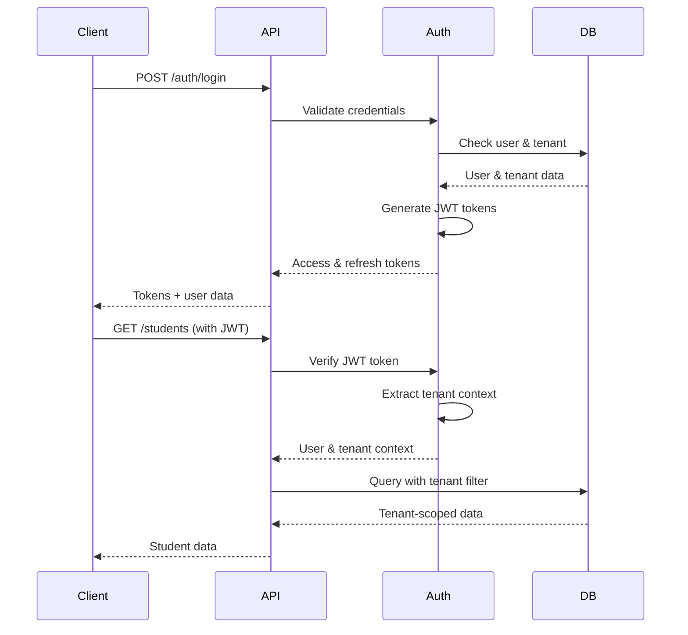

# Authentication Security

Authentication system and security features

## Overview

This page contains documentation migrated from the repository to provide better organization and collaboration capabilities.

## Content

*Content will be populated during migration process*

---

*This page was automatically generated during the documentation migration process.*


---

## From docs/Authentication-RBAC.md

<!-- Migrated from: docs/Authentication-RBAC.md -->

# Authentication & Role-Based Access Control (RBAC)

## Overview

This document describes the comprehensive authentication and role-based access control system for the K-12 Student Information System. The system provides secure, multi-tenant authentication with granular permissions and complete audit trails.

## Authentication Architecture

### JWT-Based Authentication

The system uses JSON Web Tokens (JWT) for stateless authentication with the following characteristics:

- **Access Tokens**: Short-lived (15 minutes) for API requests
- **Refresh Tokens**: Long-lived (7 days) for token renewal
- **RS256 Signing**: Secure token signing with private/public key pairs
- **Multi-Tenant Support**: Tokens include tenant context

### Token Structure

#### Access Token Payload
```json
{
  "userId": "user-uuid",
  "email": "admin@springfield.edu",
  "role": "admin",
  "tenantId": "tenant-uuid",
  "permissions": ["student.create", "student.read", "student.update"],
  "iat": 1640995200,
  "exp": 1640996100,
  "iss": "sis-platform",
  "aud": "sis-api"
}
```

#### Refresh Token Payload
```json
{
  "userId": "user-uuid",
  "type": "refresh",
  "tenantId": "tenant-uuid",
  "iat": 1640995200,
  "exp": 1641600000,
  "iss": "sis-platform",
  "aud": "sis-api"
}
```

## Multi-Tenant Authentication

### Tenant Context Resolution

The system automatically resolves tenant context through multiple methods:

#### 1. Subdomain Resolution
```
https://springfield.sisplatform.com/api/students
→ Extract "springfield" as subdomain
→ Look up tenant by subdomain
```

#### 2. Custom Domain Resolution
```
https://sis.springfield.edu/api/students
→ Look up tenant by domain
→ Route to appropriate tenant
```

#### 3. Header-Based Resolution
```http
X-Tenant-ID: 123e4567-e89b-12d3-a456-426614174000
X-Tenant-Slug: springfield
```

#### 4. JWT Token Resolution
```json
{
  "tenantId": "tenant-uuid",
  "userId": "user-uuid"
}
```

### Authentication Flow



## Role-Based Access Control (RBAC)

### Role Hierarchy

The system implements a 6-tier role hierarchy with clear permission boundaries:

```
Super Admin (100)
├── Admin (80)
├── Principal (60)
├── Teacher (40)
├── Parent (20)
└── Student (10)
```

### Role Definitions

#### 1. Super Admin
**Level**: 100  
**Scope**: System-wide access across all tenants  
**Responsibilities**:
- Create and manage tenants
- System configuration and maintenance
- Global user management
- System-wide reporting and analytics

**Key Permissions**:
- `tenant.create`, `tenant.read`, `tenant.update`, `tenant.delete`
- `tenant.suspend`, `tenant.reactivate`, `tenant.billing`
- `user.create`, `user.read`, `user.update`, `user.delete`
- `system.admin`, `system.config`, `system.backup`

#### 2. Admin
**Level**: 80  
**Scope**: Full access within their tenant (school)  
**Responsibilities**:
- Manage all users within their school
- Configure school settings and branding
- Manage students, teachers, and classes
- Generate reports and analytics

**Key Permissions**:
- `user.create`, `user.read`, `user.update`, `user.delete`
- `student.create`, `student.read`, `student.update`, `student.delete`
- `teacher.create`, `teacher.read`, `teacher.update`, `teacher.delete`
- `class.create`, `class.read`, `class.update`, `class.delete`
- `grade.create`, `grade.read`, `grade.update`, `grade.delete`
- `attendance.create`, `attendance.read`, `attendance.update`, `attendance.delete`
- `report.create`, `report.read`, `report.update`, `report.delete`

#### 3. Principal
**Level**: 60  
**Scope**: School-wide oversight and management  
**Responsibilities**:
- Oversee academic programs and teacher performance
- Review student progress and interventions
- Manage school-wide policies and procedures
- Generate administrative reports

**Key Permissions**:
- `student.read`, `student.update`
- `teacher.read`, `teacher.update`
- `class.read`, `class.update`
- `grade.read`, `grade.update`
- `attendance.read`, `attendance.update`
- `report.create`, `report.read`

#### 4. Teacher
**Level**: 40  
**Scope**: Access to assigned classes and students  
**Responsibilities**:
- Manage grades and assignments for their classes
- Track attendance for their classes
- Communicate with students and parents
- Generate class reports

**Key Permissions**:
- `student.read` (assigned classes only)
- `class.read` (assigned classes only)
- `grade.create`, `grade.read`, `grade.update` (assigned classes only)
- `attendance.create`, `attendance.read`, `attendance.update` (assigned classes only)
- `communication.send`, `communication.read`

#### 5. Parent
**Level**: 20  
**Scope**: Access to their own children's information  
**Responsibilities**:
- Monitor child's academic progress
- View grades and attendance
- Communicate with teachers
- Update contact information

**Key Permissions**:
- `student.read` (own children only)
- `grade.read` (own children only)
- `attendance.read` (own children only)
- `communication.send`, `communication.read`

#### 6. Student
**Level**: 10  
**Scope**: Access to their own information  
**Responsibilities**:
- View their own grades and attendance
- Access assignments and class materials
- Communicate with teachers
- Update personal information

**Key Permissions**:
- `student.read` (own data only)
- `grade.read` (own grades only)
- `attendance.read` (own attendance only)
- `communication.read`

### Permission System

#### Permission Categories

1. **Resource Permissions**: CRUD operations on specific resources
   - `student.create`, `student.read`, `student.update`, `student.delete`
   - `teacher.create`, `teacher.read`, `teacher.update`, `teacher.delete`
   - `grade.create`, `grade.read`, `grade.update`, `grade.delete`

2. **System Permissions**: System-wide operations
   - `system.admin`, `system.config`, `system.backup`
   - `tenant.create`, `tenant.update`, `tenant.delete`

3. **Communication Permissions**: Messaging and notifications
   - `communication.send`, `communication.read`, `communication.manage`

4. **Reporting Permissions**: Report generation and access
   - `report.create`, `report.read`, `report.update`, `report.delete`

5. **Integration Permissions**: External system integration
   - `integration.manage`, `integration.sync`

#### Explicit Permissions

Users can have additional permissions beyond their role:

```json
{
  "role": "teacher",
  "permissions": {
    "report.export": true,
    "integration.manage": true,
    "student.bulk_import": true
  }
}
```

## Resource Ownership

### Ownership Rules

#### Student Access
- **Teachers**: Can access students in their assigned classes
- **Parents**: Can access their own children (defined by parent-child relationship)
- **Students**: Can access their own data only
- **Admins**: Can access all students in their tenant

#### Grade Access
- **Teachers**: Can manage grades for their assigned classes
- **Students/Parents**: Can view their own grades
- **Admins**: Can view all grades in their tenant

#### Class Access
- **Teachers**: Can access their assigned classes
- **Students**: Can access classes they're enrolled in
- **Admins**: Can access all classes in their tenant

### Ownership Validation

```javascript
// Example: Check if teacher can access student
const canAccessStudent = async (teacherId, studentId) => {
  const student = await Student.findByPk(studentId, {
    include: [{
      model: Class,
      through: Enrollment,
      where: {
        teacherId: teacherId
      }
    }]
  });
  
  return student && student.Classes.length > 0;
};
```

## Security Features

### Password Security

#### Password Requirements
- **Minimum Length**: 8 characters
- **Complexity**: Must include uppercase, lowercase, numbers, and special characters
- **History**: Cannot reuse last 5 passwords
- **Expiration**: 90-day password expiration (configurable)

#### Password Hashing
```javascript
// bcrypt with salt rounds ≥ 12
const saltRounds = 12;
const hashedPassword = await bcrypt.hash(password, saltRounds);
```

### Account Security

#### Account Lockout
- **Failed Attempts**: Account locked after 5 failed login attempts
- **Lockout Duration**: 2 hours (configurable)
- **Progressive Lockout**: Increasing lockout duration for repeated failures

#### Two-Factor Authentication (2FA)
- **TOTP Support**: Google Authenticator, Authy, etc.
- **SMS Backup**: SMS-based 2FA as backup option
- **Recovery Codes**: One-time recovery codes for account recovery
- **Enforcement**: Required for admin accounts, optional for others

### Session Management

#### Session Security
- **Automatic Logout**: 15-minute idle timeout
- **Multi-Device Support**: Track and manage multiple sessions
- **Session Hijacking Prevention**: Device fingerprinting and IP validation
- **Secure Storage**: HttpOnly cookies for refresh tokens

#### Token Management
```javascript
// Token refresh flow
const refreshToken = async (refreshToken) => {
  const decoded = jwt.verify(refreshToken, process.env.JWT_REFRESH_SECRET);
  const user = await User.findByPk(decoded.userId);
  
  if (!user || !user.isActive()) {
    throw new Error('Invalid refresh token');
  }
  
  return {
    accessToken: generateAccessToken(user),
    refreshToken: generateRefreshToken(user)
  };
};
```

## API Security

### Request Validation

#### Input Sanitization
```javascript
// Example: Student creation validation
const validateStudent = [
  body('firstName').notEmpty().withMessage('First name is required'),
  body('lastName').notEmpty().withMessage('Last name is required'),
  body('gradeLevel').isIn(['K', '1', '2', '3', '4', '5', '6', '7', '8', '9', '10', '11', '12']),
  body('dateOfBirth').isISO8601().withMessage('Invalid date format'),
  body('email').optional().isEmail().withMessage('Invalid email format')
];
```

#### SQL Injection Prevention
- **Parameterized Queries**: All database queries use parameterized statements
- **Input Validation**: All input validated before database operations
- **ORM Protection**: Sequelize ORM provides additional protection

### Rate Limiting

#### Rate Limit Configuration
```javascript
const rateLimits = {
  auth: {
    windowMs: 15 * 60 * 1000, // 15 minutes
    max: 5, // 5 attempts per window
    message: 'Too many authentication attempts'
  },
  api: {
    windowMs: 60 * 1000, // 1 minute
    max: 100, // 100 requests per minute
    message: 'Too many API requests'
  },
  bulk: {
    windowMs: 60 * 1000, // 1 minute
    max: 10, // 10 bulk operations per minute
    message: 'Too many bulk operations'
  }
};
```

### CORS Configuration

```javascript
const corsOptions = {
  origin: function (origin, callback) {
    // Allow requests from tenant domains
    if (allowedOrigins.includes(origin) || !origin) {
      callback(null, true);
    } else {
      callback(new Error('Not allowed by CORS'));
    }
  },
  credentials: true,
  optionsSuccessStatus: 200
};
```

## Audit Logging

### Comprehensive Audit Trail

#### Logged Events
- **Authentication**: Login, logout, failed attempts, password changes
- **Data Modifications**: Create, update, delete operations
- **Permission Changes**: Role changes, permission grants/revokes
- **System Events**: Configuration changes, system maintenance

#### Audit Log Structure
```json
{
  "id": "audit-uuid",
  "tenantId": "tenant-uuid",
  "userId": "user-uuid",
  "userEmail": "admin@springfield.edu",
  "userRole": "admin",
  "action": "student.update",
  "resourceType": "student",
  "resourceId": "student-uuid",
  "ipAddress": "192.168.1.100",
  "userAgent": "Mozilla/5.0...",
  "requestMethod": "PUT",
  "requestUrl": "/api/students/student-uuid",
  "oldValues": {
    "gradeLevel": "9",
    "phone": "(217) 555-0123"
  },
  "newValues": {
    "gradeLevel": "10",
    "phone": "(217) 555-0124"
  },
  "success": true,
  "createdAt": "2024-01-15T10:30:00Z"
}
```

### Compliance Features

#### FERPA Compliance
- **Access Logging**: All access to student records logged
- **Data Modification Tracking**: Complete audit trail for all changes
- **Parent Access**: Parent access to their children's records
- **Data Retention**: Configurable retention policies

#### COPPA Compliance
- **Age Verification**: Student age verification and tracking
- **Parental Consent**: Parental consent tracking and management
- **Data Minimization**: Minimal data collection for students under 13
- **Secure Storage**: Enhanced security for children's data

#### GDPR Compliance
- **Data Subject Rights**: Access, rectification, erasure, portability
- **Consent Management**: Granular consent tracking and management
- **Data Processing Records**: Complete data processing documentation
- **Privacy by Design**: Privacy considerations in all data handling

## Testing Authentication

### Unit Tests

```javascript
describe('Authentication', () => {
  test('should authenticate valid user', async () => {
    const response = await request(app)
      .post('/api/auth/login')
      .send({
        email: 'admin@springfield.edu',
        password: 'secure-password',
        tenantSlug: 'springfield'
      });
    
    expect(response.status).toBe(200);
    expect(response.body.data.accessToken).toBeDefined();
    expect(response.body.data.refreshToken).toBeDefined();
  });
  
  test('should reject invalid credentials', async () => {
    const response = await request(app)
      .post('/api/auth/login')
      .send({
        email: 'admin@springfield.edu',
        password: 'wrong-password',
        tenantSlug: 'springfield'
      });
    
    expect(response.status).toBe(401);
  });
});
```

### Integration Tests

```javascript
describe('RBAC Integration', () => {
  test('teacher should only access their students', async () => {
    const teacherToken = await getTeacherToken();
    const response = await request(app)
      .get('/api/students')
      .set('Authorization', `Bearer ${teacherToken}`);
    
    expect(response.status).toBe(200);
    // Verify only students from teacher's classes are returned
    response.body.data.forEach(student => {
      expect(student.Classes).toContain(teacherClassId);
    });
  });
});
```

### API Testing

```bash
# Test authentication with curl
curl -X POST http://localhost:3000/api/auth/login \
  -H "Content-Type: application/json" \
  -d '{
    "email": "admin@springfield.edu",
    "password": "secure-password",
    "tenantSlug": "springfield"
  }'

# Test protected endpoint
curl -X GET http://localhost:3000/api/students \
  -H "Authorization: Bearer YOUR_JWT_TOKEN" \
  -H "Content-Type: application/json"
```

## Security Best Practices

### Development Guidelines

1. **Always Validate Input**: Validate and sanitize all user input
2. **Use Parameterized Queries**: Prevent SQL injection attacks
3. **Implement Rate Limiting**: Protect against brute force attacks
4. **Log Security Events**: Comprehensive audit logging
5. **Use HTTPS**: Encrypt all communications

### Production Security

1. **Secure Secrets**: Use environment variables for sensitive data
2. **Regular Updates**: Keep dependencies and system updated
3. **Monitor Access**: Monitor for suspicious activity
4. **Backup Security**: Secure backup storage and access
5. **Incident Response**: Have security incident response procedures

### Compliance Maintenance

1. **Regular Audits**: Conduct regular security audits
2. **Access Reviews**: Regular review of user access and permissions
3. **Training**: Security awareness training for all users
4. **Documentation**: Maintain security documentation and procedures
5. **Testing**: Regular security testing and penetration testing

## Troubleshooting

### Common Issues

#### Authentication Failures
- **Invalid Credentials**: Check email/password combination
- **Account Locked**: Wait for lockout period or contact admin
- **Token Expired**: Use refresh token to get new access token
- **Tenant Not Found**: Verify tenant slug or domain

#### Permission Denied
- **Insufficient Role**: Check user role and required permissions
- **Resource Ownership**: Verify user has access to specific resource
- **Tenant Context**: Ensure proper tenant context resolution
- **Feature Access**: Check if feature is enabled for tenant

#### Session Issues
- **Token Invalid**: Verify token signature and expiration
- **Multi-Device**: Check for conflicting sessions
- **Network Issues**: Verify network connectivity and DNS resolution

### Debug Tools

```javascript
// Enable debug logging
DEBUG=auth:*,rbac:*,tenant:* npm start

// Check user permissions
console.log('User permissions:', getUserPermissions(user));

// Verify tenant context
console.log('Tenant context:', req.tenant);
console.log('User context:', req.user);
```

This authentication and RBAC system provides enterprise-grade security for the K-12 Student Information System, ensuring complete tenant isolation while maintaining granular access control and comprehensive audit trails for compliance.
